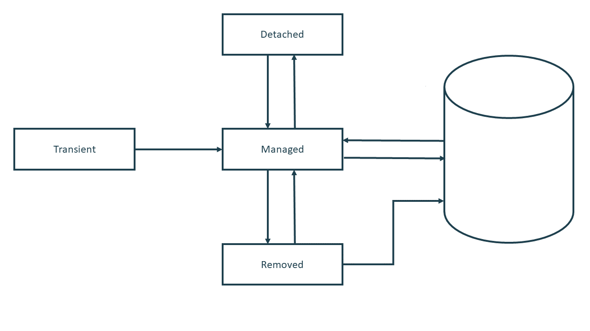
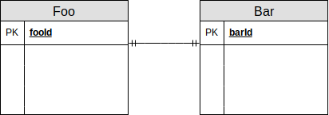
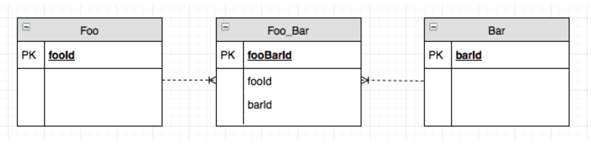
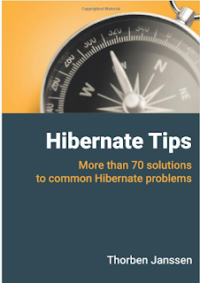

## Hibernate


---

##### Czym jest Hibernate?

**Hiberate** to framework zapewniający implementację warstwy dostępu do danych (tak znanej *warstwy trwałości* czyli *persistence layer*) oraz translację danych z struktury relacyjnej na obiektową.

Ze wględu na to, że **Hibernate** zapewnia mapowanie danych z baz relacyjnych na obiekty jest nazywane frameworkiem **ORM** (*Object-Relational Mapping*).

**Hibernate** jest implementacją specyfikacj **JPA** (*Java persistance layer*).


Note: Hibernate powstało w 2001, a JPA w 2006. Inne implementacje: iBatis, EclipseLink, OpenJPA. Istnieją też ORM nie implementujące JPA.

---

##### Architektura wartwowa

Termin *warstwa trwałości* (*persistance layer*) pochodzi z pojęcia *architektury n-wartwowej* (*three-tier architecture*), gdzie naczęściej warstwy są trzy:


---

##### Co próbuje osiągnąć JPA/Hibernate?

 * rozwiązenie problemu niedopasowania światów relacyjnego i obiektowego
 * zapewnienie eleganckiej abstracji kodu odpowiedzialnego za *persistance* (redukcja tzw. *boilerplate code*)
 * stworzenie wspólnej warstwę abstrakcji nad różnymi systemami bazodanowymi

Note: problemy w wyznaczeniem identyczności, hierarchią podtypów, problem z odwzorowaniem asocjacji 

---

##### Alternatywy?

 * ręczne stworzenie wartwy trwałości w **JDBC**.
 * użycie biblioteki, która rozwiązuje problemy związane z powtarzalnym kodem i przekształcaniem danych na obiekty, ale nie zapewnia mapowania relacyjno-obiektowego. 

Note: Na przykład jooq, JdbcTemplate

---

#### W jaki sposób działa Hibernate?
##### Na początek parę pojęć:

---

##### Session

Egzemplarze interfejs `Session` to *lekkie* obiekty, a koszt ich utworzenia i zniszczenia jest niewielki.
Podczas działania aplikacji cały czas tworzy i usuwa obiekty `Session`, często używając je tylko do wykonania jednego zapytania.

##### SessionFactory

Zadaniem `SessionFactory` jest tworzenie egzemplarzy `Session`. 
Najczęściej istnieje tylko jeden egzemplarz `SessionFactory`, ale jeżeli aplikacja łączy się z wieloma bazami danych na raz, to może istnieć ich wiele.


Note: Sesja w Hibernate nie ma nic wspólnego z sesją HTTP! Session nie jest thread-safe. Session jest thread-safe. Session i SessionFactory są hibernate-specific.

---

##### EntityManager i Entity

**JPA** definiuje wspólną dla wszystkich implementacji abstakcję:

 * `EntityManager` dla `Session`
 * `EntityManagerFactory` dla `SessionFactory`
 
Obydwa interfejsy są adepterami (*wrapper*) delegujacymi wywołania do implementacji z **Hibernate**:  
 
 ```java
 SessionFactory factory = entityManagerFactory.unwrap(SessionFactory.class);
 
 Session session = entityManager.unwrap(Session.class);
 ``` 

---

##### Jak pobrać lub stworzyć EntityManager?

**JPA** może zarządzać kontener aplikacji. W tym przypadku możemy użyć:

```java
@PersistenceContext
EntityManager entityManager;
```

W przypadku gdy sami zarządamy **JPA**:


```java
EntityManagerFactory emf = Persistence.createEntityManagerFactory();
...
EntityManager entityManager = emf.createEntityManager();
```

---

##### Entity 

*Entity* (*encja*) to obiekt, lub zespół obiektów, które przechowują jakiś stan.

 * Stan encji może być zapisany w bazie danych, encja z danym stanem może zostać również wczytana z bazy danych.
 * Powinna istnieć możliwość jednoznacznego zidentyfikowania encji. Może do tego służyć unikalny identyfikator.
 
---

Klasy encji to POJO z metadanymi przekazanymi za pomocą adnotacji:

```java

@Entity
@Table(name = "emp")
public class Employer {
   @Id
   @GeneratedValue(strategy = GenerationType.IDENTITY)
   private Long id;
   
   @Column(name = "empname")
   private String name;
   
   private String title;
   
   //settery i gettery
}
```
---
###### Adnotacje klas:

* `@Entity` oznacza klasę jako encję. Ta adnotacja jest wymagana.
* `@Table` oznacza do jakiej tabeli odnosi sie encja. Jeżeli nie jest użyta, to JPA spróbuje wywnioskować nazwę tabeli.

###### Adnotacje pól:

* `@Column` pozwala zdefiniować do której kolumny odnosi się pole. Jeżeli nie jest użyta, to JPA spróbuje wywnioskować nazwę kolumny. 
* `@Id` pozwala oznaczyć pole jako klucz główny.
* `@GeneratedValue` pozwala zdefiniować strategię generacji klucza głównego.

Note: To tylko adnotacje potrzebne na początek. Metadane mapowania mogą być równeż opisane w plikach xml.

---

##### Cykl życia encji

Encja może mieć stan:

 * **Managed/Persistent** - encja jest zarządzana przez **Hibernate**.
 * **Transient** - encja nie jest i nie była zarządzana przez **Hibernate** (została na przykład dopiero co stworzona przez konstruktor).
 * **Detached** - encja nie jest zarządzana przez **Hibernate** ale była zarządzana.
 * **Removed** - encja jest oznaczona do usunięcia.
 
Zmiany stanu i danych encji nie muszą być od razu odzwierciedlane na bazie danych. Dzieje się to podczas cyklu `flush` sesji **Hibernate**.

Note: Hibernate opóźnia zapis, dzięki czemu może stosować rózne optymalizacje, tak jak nie robi update, na encjach, które potem zostaną usunięte.

---



---

##### Metody EntityManagera

* **detach** odłącza obiekt z sesji.
* **merge** uaktualnia zarządzaną encję, której pola zostały zmienione.
* **persist** rozpoczyna zarządzanie encją i zapisuje ją do bazy danych.
* **refresh** nadpisuje zmiany w encji stanem z bazy danych.
* **remove** usuwa encję.
* **find** wczytuje encję z bazy.
* **getReference** leniwie wczytuje encję z bazy.


```java
Student student = new Student();
student.setFirstName("Włodzimierz");
student.setLastName("Rumak");
em.persist(student);

student.setFirstname("Włodek");
em.merge(student);
```

Note: getReference może wzrócić `hollow object`, którego wszystkie pola oprócz id są leniwie zaczytywane

---
##### Jak skonfigurować JPA?

Hibernate możemy konfigurować poprzez pliki `persistance.xml` lub `hibernate.cfg.xml`:

```xml
...
<persistence-unit name="my-persistence-unit">
  <properties>
    <property name="javax.persistence.jdbc.driver" value="org.postgresql.Driver" />
...
  <class>pl.atk.model.Professor</class>
  <mapping-file>myMappings.xml</mapping-file>
  <provider>org.eclipse.persistence.jpa.PersistenceProvider</provider>
...

```

Note: Kropki to nie część XML! Dla persistence.xml podajemy peristence providera.

---

##### Możemy też zrobić konfigurację w kodzie:

```java
LocalContainerEntityManagerFactoryBean entityManagerFactoryBean 
    = new LocalContainerEntityManagerFactoryBean();
entityManagerFactoryBean.setPackagesToScan("pl.atk.model.*"):
entityManagerFactoryBean.setPersistenceProviderClass(
        HibernatePersistence.class
);
settings.put(Environment.DRIVER, "com.mysql.cj.jdbc.Driver");
settings.put(Environment.SHOW_SQL, "true");
...
```

---

##### Jakie opcje konfiguracyjne możemy ustawić?

 * `driverClassName` to pełna kwalifikowana nazwa sterownika do danej bazy danych. Na przykład *com.mysql.cj.jdbc.Driver*.
 * `username` i `password` to nazwa użytkownika i haslo do bazy danych.
 * `hibernate.show_sql` oraz `hibernate.format_sql` ustawiają czy logować na konsoli zapytania i czy je formatować.
 * `hibernate.dialect` ustawia dialekt bazy danych.
 
Note: Nie ustawiać dialektu hibernate

---

Opcja `url` pozwala na zdefiniowane adresu bazy danych:

**jdbc:<span style="color:orange">silnik</span>://<span style="color:purple">host</span>:<span style="color:aqua">port</span>/<span style="color:pink">baza</span>** 

**jdbc:<span style="color:orange">mysql</span>://<span style="color:purple">192.168.33.40</span>:<span style="color:aqua">3306</span>/<span style="color:pink">szkola</span>** 

Note: W naszym przypadku adres IP to prawdopodobnie localhost. W URL można przekaząć też parametry zapytania, którę będą obowiazywały w połączeniu. Przykład: strefa czasowa.

---

Właściwość `hibernate.hbm2ddl.auto` może przyjmować cztery wartośći: **update**, **create**, **create-drop**, **validate**.
Służą one do uaktualniania schematu bazy danych automatycznie przez hibernate (3 pierwsze) lub do sprawdzenia zgodności między schematem, a klasami.

###### Produkcyjnie można używać tylko **validate**!

---

Możemy skonfigurować również `Connection Pool`.

`Connection Pool` to pośrednik między sterownikiem, a bazą danych. Nawiązuje stałą liczbę połączeń z bazą i pozostawia je otwarte niezależnie od żądań ze strony aplikacji dotyczących otwarcia nowego lub zerwania stałego połączenia.
Kiedy klient kończy sesję, połączenie nie zostaje zerwane, zeruje się jedynie sesję klienta, a połączenie może być ponownie wykorzystane dla nowej sesji. 

Note: HikariCP, c3p0. Zadania

---

### Relacje między obiektami

---

##### Relacja one-to-one 



Można zamodelować jako jednokierunkową referencję do innego obiektu:

```java
@OneToOne
private Bar bar;
```

---

Relacja może być też dwukierunkowa:

```java
@Entity
public class Foo {
  private Long fooId;
  
  @OneToOne
  @JoinColumn(name = "barId")
  private Bar bar;
}

@Entity
  public class Bar {
  private Long barId;
  
  @OneToOne(mappedBy = "bar")
  private Foo foo;
}
```

---
##### Relacja one-to-many 


---

Jednokierunkowa:

```java
@Entity
public class Foo {
     
  @OneToMany
  @JoinColumn(name = "barId")
  private Set<Bar> items = new HashSet<Item>();
}
```

---

Dwukierunkowa:

```java
@Entity
public class Foo {
  @OneToOne
  @JoinColumn(name = "barId")
  private Bar bar;
}

@Entity
public class Bar {
  @OneToOne(mappedBy = "bar")
  private Foo foo;
}
```

---
##### Relacja many-to-many 



---

Relację **many-to-many** można zamodelować za pomocą ręcznie zarządzanej tabeli:

```java
@Entity
public class Foo {
  private Long fooId;
 
  @OneToMany(mappedBy = "bar")
  private List<Bar> bars;
}

@Entity
public class Bar {
  private Long barId;
  
  @ManyToOne
  @JoinColumn(name = "fooId")
  private Foo foo;
```
---

Tabela łącząca może zawierać dodatkowe pola:

```java
@Entity
public class FooBar {
  @Id
  private Long fooBarId;
  
  @ManyToOne
  @JoinColumn(name = "fooId")
  private Foo foo;
  
  @ManyToOne
  @JoinColumn(name = "barId")
  private Bar bar;
  
  LocalDate createdAt;
}
```
---

Relacja **many-to-many** może też być zarządzana przez **Hibernate**:


```java
@Entity
public class Foo {
private Long fooId;
@OneToMany
  @JoinTable(name="FooBar",
  joinColumns = @JoinColumn(name="fooId"),
  inverseJoinColumns = @JoinColumn(name="barId"))
  private List<Bar> bars;
}

@Entity
public class Bar {
private Long barId;
@OneToMany
  @JoinTable(name="FOO_BAR",
  joinColumns = @JoinColumn(name="barId"),
  inverseJoinColumns = @JoinColumn(name="fooId"))
  private List<Foo> foos;
}
```

---
##### Eager vs Lazy Loading

* **Eager** (*chętne*) Loading oznacza, że dane zależne zostaną załadowane podczas pierwszego wczytywania obiektu. Domyślnie wszystkie pola ładowane są chętnie.

* **Lazy** (*leniwe*) Loading oznacza, że dane zostaną wczytane, kiedy będą potrzebne, to znaczy zostanie wywołana metoda gettera. Domyślnie wszystkie zależności ładowane są leniwie.

Możemy to zmienić adnotacjami:

```java
@OneToOne(fetch=FetchType.EAGER)
```

---

### Uwaga na LazyInitializationException!

Note: Jeżeli sesja zostanie zamknięta przed tym zanim wywołamy metodę dostępową, to poleci wyjątek.

---
##### Kaskadowanie
Encje z zależnościami mogą mieć również skonfigurowane ustawienia kaskadowania. Ustawienie kaskady oznacza przykładowo to, że **Hibernate** 
zapisze też zmiany na encjach zależnych (dla **SAVE_UPDATE**), lub usunie je (dla **REMOVE**).

```java
@OneToOne(cascade = CascadeType.ALL)
```


---
##### Zagnieżdżanie obiektów

Struktura encji nie musi koniecznie być płaska. Możemy zagnieździć w niej obiekty, które mają adnotacje `@Embeddable` za pomocą
adnotacji `@Embedded`.

```java
@Embeddable
public class FullName{
    String salutation;
    String firstName;
    String lastName;
}
```

```java
@Entity
class Person {
    @Embedded FullName fullName;
}

```
---

##### W jaki sposób zmapować Enuma z Hibernate?

Możemy użyć adnotacji `Enumerated`.Możliwe opcje:

* `ORDINAL` - nie zalecane!
* `STRING`

```java
public enum Status {
	STOPPED, RUNNING, PAUSED
}
```

```java
@Enumerated(EnumType.STRING)
private Status status;
```

Note: Nie używać inta, bo może sie pomieszać. Można zmapować do osobnej tabeli, lub enumeracji z Postresql.

---

##### JPQL

**JPQL** (lub **HQL**) to wbudowany w **JPA** specjalny język zapytań podobny do *SQL* ale zorientowany obiektowo:

```sql
From EntityName

Select id, name From Employee

From Employee where id = 22

From Author a, Book b Where a.id = book.author

Select employer From Employer Left Join Fetch employer.employee
```

```java
TypedQuery<Person> q = em.createQuery("select m from Person m", Person.class);
List<Person> people = q.getResultList();
```

Note: join fetch to rozwiązanie dla LazyInitializationException

---

Możemy definiować tez zapytania w encji, tzw. `NamedQueries`:

```java
@Entity
@NamedQuery(name="Country.findById", query="Select c From Country c Where c.id = :id") 
public class Country {
```

```java
TypedQuery<Country> query =
  em.createNamedQuery("Country.findAll", Country.class);
Country country = query.setParameter("id", 5).getSingleResult();;
```

---

Możemy zapisywać wyniki zapytania do dowolnego obiektu. Jest to tak zwane *DTO Projection*:

```java

TypedQuery<BookWithAuthorNames> q = em.createQuery(
        "SELECT pl.atk.BookWithAuthorNames(" +
            "b.id, b.title, b.price, concat(a.firstName, ' ', a.lastName)" +
            ") FROM Book b JOIN b.author a WHERE b.title LIKE :title",
        BookWithAuthorNames.class);
q.setParameter("title", "%Hibernate Tips%");
List<BookWithAuthorNames> books = q.getResultList();

```

Note: Drugie rozwiązanie dla LazyInitializationException

---
##### JPA definiuje zdarzenia zwrotne cyklu życia encji

* `@PrePersist`
* `@PostPersist`
* `@PostLoad`
* `@PreUpdate`
* `@PostUpdate`
* `@PreRemove`
* `@PostRemove`

```java
@PostRemove
void afterRemove() {
    System.out.println("Usunięto!");
}
```

---
W **JPA** można wykonanywać też natywne zapytania:

```java
List<Object[]> result = entityManager
    .createNativeQuery("SELECT * FROM some_table")
    .list();
```

---
 

##### Adnotacja @Filter

```java
@Entity
public class School {
  @OneToMany
  @Filter(name = "active", condition = "SELECT * FROM Student s WHERE s.state = true")
  Set<Student> students;
```

---

### Stategie dziedziczenia

---

##### Mapped superclass

```java
@MappedSuperclass
public abstract class Publication {

	@Id
	protected Long id;

	@Column
	protected String title;
}
```

```java
@Entity
public class Book extends Publication {

	@Column
	private int pages;
}
```

Ta strategia wymaga tabeli na każdą klasę dziedziczącą.

Note: Publikacja może mieć url, wideo długość itd.

---

##### Table Per Class

```java
@Entity
@Inheritance(strategy = InheritanceType.TABLE_PER_CLASS)
public abstract class Publication {

	@Id
	protected Long id;

	@Column
	protected String title;
}
```

```java
@Entity
public class Book extends Publication {

	@Column
	private int pages;
}
```

Ta strategia wymaga jednej tabeli na każdą klasę dziedziczącą oraz rodzica.

---

##### Single Table

```java
@Entity
@Inheritance(strategy = InheritanceType.SINGLE_TABLE)
@DiscriminatorColumn(name = "Publication_Type”)
public abstract class Publication {

	@Id
	protected Long id;

	@Column
	protected String title;
```

```java
@Entity(name = "Book”)
@DiscriminatorValue("Book”)
public class Book extends Publication {

	@Column
	private int pages;
}

```

Ta strategia wymaga tylko jednej tabeli z dodatkową kolumną `dyscriminator`.

---

##### Joined table

```java
@Entity
@Inheritance(strategy = InheritanceType.JOINED)
public abstract class Publication {

        @Id
        @GeneratedValue(strategy = GenerationType.AUTO)
        @Column(name = "id”, updatable = false, nullable = false)
        protected Long id;

        @Column
        protected String title;
```

Ta strategia wymaga róznież jednej tabeli na klasę dziedziczącą, ale ilość kolumn jest zredukowana.

---

### Polecane materiały:

##### Blogi:

* https://thoughts-on-java.org
* https://vladmihalcea.com


##### Książki:




