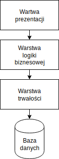

### Wprowadzenie do JDBC
    

---

# **<span style="color:salmon">JDBC</span>** 

### **<span style="color:salmon">J</span>ava <span style="color:salmon">D</span>ata<span style="color:salmon">B</span>ase <span style="color:salmon">C</span>onnectivity** 

**JDBC** to interfejs programowania opracowany w 1996 r, umożliwiający aplikacjom napisanym w języku **Java** porozumiewanie się z bazami danych za pomocą języka **SQL**.
Przy pomocy **JDBC** możemy tworzyć tak zwaną warstwę trwałości (*Persistence Layer*).

---

##### Architektura wartwowa

Termin *warstwa trwałości* (*persistance layer*) pochodzi z pojęcia *architektury n-wartwowej* (*three-tier architecture*), gdzie naczęściej warstwy są trzy:



---

**Driver** to interfejs odpowiadający za warstwę bezpośrednio kontaktującą się z bazą danych. Dla różnych silników bazodanowych mogę istnieć inne implementacje.


---

**Connection** to klasa reprezentująca połączenie do bazy danych.

Obiekt **Connection** możemy tworzyć za pomocą klasy **DriverManager**:

```java
Connection c = DriverManager.getConnection(url, "user", "password");
```

---

Łańcuch znaków *URL* jest przekazywany do drivera i pozwala mu zlokalizować i nawiązać połaczenie z bazą dancyh.

**jdbc:<span style="color:orange">silnik</span>://<span style="color:purple">host</span>:<span style="color:aqua">port</span>/<span style="color:pink">baza</span>** 

**jdbc:<span style="color:orange">mysql</span>://<span style="color:purple">192.168.33.40</span>:<span style="color:aqua">3306</span>/<span style="color:pink">szkola</span>** 

---

Do tworzenia obiektów **Connection** możemy użyć też interfejsu **DataSource**. Dla konkretnych silników bazodanowych będą istnieć konkretne implementacje **DataSource**,
na przykład **MysqlDatasource**:

```java
MysqlDataSource dataSource = new MysqlDataSource();
dataSource.setUser("username");
dataSource.setPassword("password");
dataSource.setUrl("jdbc:mysql://localhost:3306/test");
```

```java
Connection c = datasource.getConnection();
```

Implementacje **DataSource** mogą obsługiwać *pule połączeń*.

Note: Może być zarządany przez kontener.

---

**Pule połączeń** to pośrednik między sterownikiem, a bazą danych. Nawiązuje stałą liczbę połączeń z bazą i pozostawia je otwarte niezależnie od żądań ze strony aplikacji dotyczących otwarcia nowego lub zerwania stałego połączenia.
Kiedy klient kończy sesję, połączenie nie zostaje zerwane, zeruje się jedynie sesję klienta, a połączenie może być ponownie wykorzystane dla nowej sesji. 

Note: HikariCP, c3p0. Zadania

---

Przykładowy kod łączący się z bazą danych:

```java
try{
  Class.forName("com.mysql.Driver"); 
  String url = "jdbc:mysql://localhost:3306/test";
  Connection c = DriverManager.getConnection(url, "user", "password");
  Statement s = c.createStatement();
  ResultSet rs = s.executeQuery("SELECT name,salary FROM employees");
  while (rs.next()) {
    System.out.println(resultSet.getString("name"));
    System.out.println(resultSet.getInt("salary"));
  }
} catch(ClassNotFoundException|SqlException e) {
  System.err.println(e);
} finally {
  rs.close();
  s.close();
  c.close();    
}
```

Note: nie trzeba ładować drivera. Jak działa ResultSet.
---

Użycie bloku **try-with-resources** uprasza strukturę kodu:

```java
String url = "jdbc:mysql://localhost:3306/test";
try( 
  Connection c = DriverManager.getConnection(url, "user", "password");
  Statement s = c.createStatement();
  ResultSet rs = s.executeQuery("SELECT name,salary FROM employees");
) {
  while (rs.next()) {
    System.out.println(resultSet.getString("name"));
    System.out.println(resultSet.getInt("salary"));
  }
} catch(SQLException e) {
  System.err.println(e);
}
```

Note: Nie trzeba pisać bloku finally. Nie trzeba ładować klasy od JDBC 4.1, zniknął wyjątek do obsłużenia.

---

| Typ DB              | Typ Java               |
|---------------------|------------------------|
| CHAR, VARCHAR 	  | String                 |
| NUMERIC, DECIMAL    |	java.math.BigDecimal   |
| BIT, BOOLEAN        |	boolean                |
| INTEGER             |	int                    |
| BIGINT 			  | long                   |
| FLOAT, DOUBLE       |	double                 |
| BINARY, VARBINARY   | byte[]                 |
| DATE 	              | java.sql.Date          |
| TIME 	              | java.sql.Time          |
| TIMESTAMP           | java.sql.Timestamp     |

Note: sql time tylko w klasa dostępu do danych

---

Najważniejsze metody interfejsu **Connection**:

* **execute** zwraca `true/false` w zależności czy operacje się powiedzie.
* **executeUpdate** zwraca liczbę dodanych/zmienionych/usuniętych wierszy.
* **executeQuery** zwraca obiekt `ResultSet`.

Note: Pierwsza pula ćwiczeń (1 i 2).

---

##### Prepared statements

**Prepared Statement** pozwalają na użycie *parametrów* w zapytaniu:

```java
String url = "jdbc:mysql://localhost:3306/test";
try( 
  Connection c = datasource.getConnection();
  PreparedStatement ps = c.prepareStatement(
          "SELECT name,salary FROM employees WHERE name = ?"
  )
) {
  s.setString(1, "Tom%");
  try(ResultSet rs = ps.executeQuery()) {
    while (rs.next()) {
      System.out.println(resultSet.getString("name"));
      System.out.println(resultSet.getInt("salary"));
    }
  }
} catch(SQLException e) {
  System.err.println(e);
}
```

Note: Indeksowanie parametrów od 1. Nie są obsługiwane parametry z nazwą. Zadanie 3. 

---

##### Transakcje

* Domyślnie `Connection` działą w trybie **auto-commit**, co oznacza, że każde pojedyńcze zapytanie wykonywane jest jako osobna transakcja.

* Żeby wykonywać więcej działań w obrębie jednej transakcji ustawiamy `connection.setAutoCommit(false)`, a następnie po wykonaniu dowolnej ilości zapytań możemy wywołać:

    * `commit`, żeby zatwierdzić transakcję
    * `rollback`, żeby wycofać transakcję
    * `setSavepoint` żeby stworzyć punkt kontrolny

---

Chcąć zatwierdzić transkację najpier wywołujemy `setAutoCommit` z parametem *false*, następnie kolejne zapytania, a na koniec
 zatwierdzamy transakcję przy pomocy&nbsp;`commit`.

```java
String url = "jdbc:mysql://localhost:3306/test";
try( 
  Connection c = DriverManager.getConnection(url, "user", "password");
  Statement s1 = c.createStatement(
    "UPDATE user SET salary = 5000 WHERE id = 1"
  );
  Statement s2 = c.createStatement(
    "UPDATE user SET salary = 7000 WHERE id = 2"
  );  
) {
  c.setAutoCommit(false);
  s1.executeUpdate();
  s2.executeUpdate();
  c.commit();
} catch(SQLException e) {
  System.err.println(e);
}
```

---

Analogicznie możemy wywołać `rollback` aby wycofać całkowicie transakcję, albo `rollback` podająć jako parametr *savepoint*,
aby wycofać tylko do miejsca jego zapisu.

```java
connection.setAutoCommit(false);

s1.executeUpdate();

Savepoint sp = conn.setSavepoint("salary_update");

s2.executeUpdate();

int max = statement.executeQuery("SELECT max(salary) FROM user").getInt(1);

if(max < 10000) {
  connection.rollback(sp);
} else if (max < 8000) {
  connection.rollback();
} else {
  connection.commit();
}
```

---
##### Wywoływanie procedur

Żeby wywołać procedurę na serwerze bazodanowych używamy obiektu typu `CallableStatement`:

```java
try (
    Connection c = DriverManager.getConnection(url, "user", "password");
    CallableStatement cs = c.prepareCall("call my_procedure(?, ?)");
) {
    cs.setLong(1, id);
    cs.setLong(1, name);
    cs.executeQuery();
} catch (SQLException exception) {
    System.err.println(e);
}
```


Note: Reszta zadań.

---

### JDBC TEMPLATE

---

**JdbcTemplate**

```java
JdbcTemplate jdbc = new JdbcTemplate(dataSource);
jdbc.query(
  "SELECT name, salary FROM employee WHERE id = ?",
  new Object[] {id},
  new StudentsResultSetExtractor()
);

```

---

**NamedParameterJdbcTemplate**

```java
NamedParameterJdbcTemplate jdbc = new NamedParameterJdbcTemplate(dataSource);
jdbc.query(
  "SELECT name, salary FROM employee " +
  "WHERE name LIKE :query OR department LIKE :query",
  new MapSqlParameterSource("query", query + "%"),
  new StudentsResultSetExtractor()
);

```
---

**TransactionTemplate**

```java
TransactionTemplate tt = new TransactionTemplate(
     new DataSourceTransactionManager(dataSource)   
);

transactionTemplate.execute( transactionStatus -> {
   // wszystkie polecania zostaną wykonane w transakcji
});
```

---

### Dobre praktyki tworzenia zapytań:

---

Do umieszczania w zapytaniu danych pochodzących od klienta, powinniśmy używać **parametrów zapytania**:

<span style="color: green; float: right; position: relative; top: -10px;">&#10004;</span>
```java
"SELECT name, salary FROM employee WHERE name = ?"; 
```

<span style="color: green; float: right; position: relative; top: -10px;">&#10004;</span>
```java
"SELECT name, salary FROM employee WHERE name = :name";
```

<span style="color: red; float: right; position: relative; top: -10px;">&#10060; </span>
```java
"SELECT name, salary FROM employee WHERE name = " + name;
```
---

Używanie niesprawdzonych danych w zapytaniu poprzez łączenie łańcuchów znaków naraża nas na **SQL Injection**.
Dane otrzymane z nieznanych źródeł należy ustawiać za pomocą **parametrów zapytania**.

---

Zapytania dodające/usuwające/zmieniające duże ilości danych wykonuj w **batchu**:

```java
int[] modified = jdbcTemplate.batchUpdate(
"UPDATE employees SET salary = ? WHERE salary = ?",
new BatchPreparedStatementSetter() {
  public void setValues(PreparedStatement ps, int i) throws SQLException {
    ps.setInt(1, newSalaries.get(i));
    ps.setInt(2, oldSalaries.get(i));
  }

  public int getBatchSize() {
    return conditions.size();
  }
});
```

Note: W Jdbc addToBatch, executeBatch
---

<span style="display:flex; align-items: center;">&nbsp;&nbsp;&nbsp;[krzysztof.atlasik@pm.me](mailto:krzysztof.atlasik@pm.me)</span>
